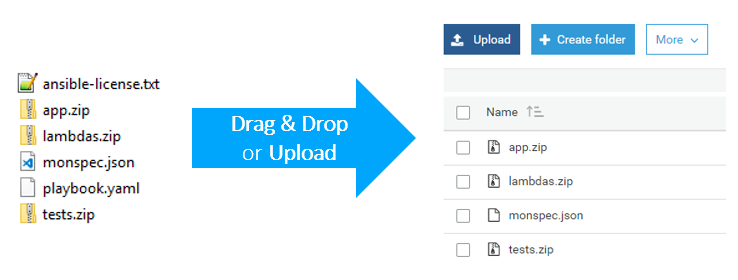
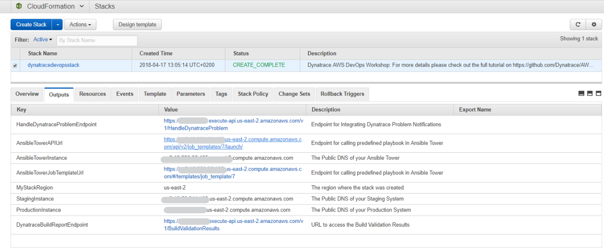
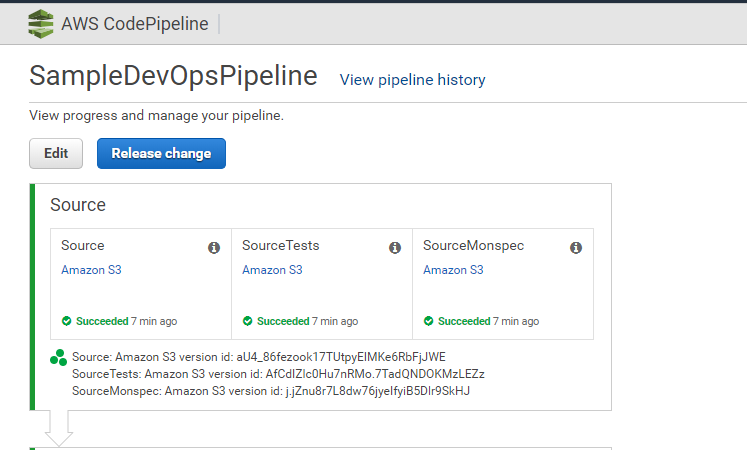
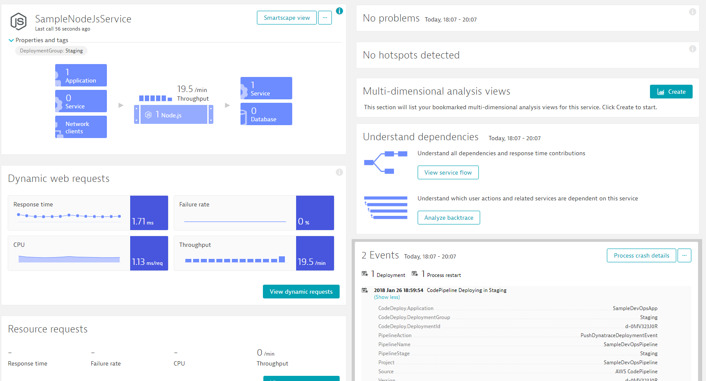

# AWSDevOpsTutorial
Unbreakable DevOps Pipeline Tutorial with AWS CodeDeploy, AWS CodePipeline, AWS Lambda, EC2 and Dynatrace.

The goal of this tutorial is having a full end-to-end AWS DevOps Pipeline (Staging, Approval, Production) that is fully monitored with Dynatrace. With Dynatrace injected into the pipeline you get the following features
1. Monitor your Staging Environment
2. Automate Approve/Reject Promotion from Staging to Production based on Performance Data
3. Monitor your Production Environment
4. Automatic Deploy of previous revision in case Dynatrace detected problems in Production

Before we launch the CloudFormation stack which will create all required resources (EC2 Instances, Lambdas, CodeDeploy, CodePipeline, API Gateway) lets make sure we have all pre-requisits covered!

## Pre-Requisits
1. You need an AWS account. If you dont have one [get one here](https://aws.amazon.com/)
2. You need a Dynatrace Account. Get your [Free SaaS Trial here!](http://bit.ly/dtsaastrial)
3. You need to clone or copy the content of this GitHub repo to your local disk!

## Preparation
**Amazon**
As we are going to use AWS CodeDeploy, AWS CodePipeline, AWS Lambda, DynamoDB, API Gateway and EC2 make sure the AWS Region you select provides all these services. We have tested this cloud formation on US-West-2a (Oregon) and US-East-2b (Ohio). To be on the safe side we suggest you pick one of these regions!

1. Create an EC2 Key Pair for your AWS Region! Our CloudFormation Template needs an EC2 Key Pair!
1.1. To learn more about Key Pairs and how to connect to EC2 Instances for troubleshooting read [Connect to your Linux Instance](https://docs.aws.amazon.com/AWSEC2/latest/UserGuide/AccessingInstances.html)
2. Create a S3 Bucket with the naming scheme: <yourname>-dynatracedevops and enable versioning. See following screenshots for reference

3. Copy the content from the folder "copytos3" to your newly created S3 bucket. This includes the application package, tests, monspec as well as all Lambda functions

**Dynatrace**
We need a couple of things to launch the CloudFormation Template
1. Your *Dynatrace Tenant URL*: For SaaS that would be something like http://<yourtenant>.live.dynatrace.com. For Managed it would be http://<yourserver>/e/<your-env-id>
2. Your *Dynatrace OneAgent for Linux Download URL*: Go to Deploy Dynatrace -> Start Installation -> Linux and copy the URL within the quotes as shown below:

3. A *Dynatrace API Token*: Go to Settings -> Integration -> Dynatrace API and create a new Token

## Lets create the CloudFormation Stack
If you haven't cloned or downloaded the full GitHub repo then download the CloudFormation stack definition from [here](./AWSDevOpsTutorialCloudFormationStack.json).

Now click on one of the regional links. This brings you to the CloudFormation Web Console where you can upload your downloaded CloudFormation Stack Definition.

Region | Launch Template
------------ | -------------
**N. Virginia** (us-east-1) | <a href="https://console.aws.amazon.com/cloudformation/home?region=us-east-1#/stacks/new?stackName=dynatracedevopsstack" target="_blank">Launch Dynatrace DevOps Stack into Virginia</a>
**Ohio** (us-east-2) | <a href="https://console.aws.amazon.com/cloudformation/home?region=us-east-2#/stacks/new?stackName=dynatracedevopsstack" target="blank">Launch Dynatrace DevOps Stack into Ohio</a>
**Oregon** (us-west-2) | <a href="https://console.aws.amazon.com/cloudformation/home?region=us-west-2#/stacks/new?stackName=dynatracedevopsstack" target="blank">Launch Dynatrace DevOps Stack into Oregon</a>
**Ireland** (eu-west-1) | <a href="https://console.aws.amazon.com/cloudformation/home?region=eu-west-1#/stacks/new?stackName=dynatracedevopsstack" target="blank">Launch Dynatrace DevOps Stack into Ireland</a>
**Frankfurt** (eu-central-1) | <a href="https://console.aws.amazon.com/cloudformation/home?region=us-central-1#/stacks/new?stackName=dynatracedevopsstack" target="blank">Launch Dynatrace DevOps Stack into Frankfurt</a>
**Tokyo** (ap-northeast-1) | <a href="https://console.aws.amazon.com/cloudformation/home?region=ap-northeast-1#/stacks/new?stackName=dynatracedevopsstack" target="blank">Launch Dynatrace DevOps Stack into Tokyo</a>
**Seoul** (ap-northeast-2) | <a href="https://console.aws.amazon.com/cloudformation/home?region=ap-northeast-2#/stacks/new?stackName=dynatracedevopsstack" target="blank">Launch Dynatrace DevOps Stack into Seoul</a>
**Singapore** (ap-southeast-1) | <a href="https://console.aws.amazon.com/cloudformation/home?region=ap-southeast-1#/stacks/new?stackName=dynatracedevopsstack" target="blank">Launch Dynatrace DevOps Stack into Singapore</a>
**Sydney** (ap-southeast-2) | <a href="https://console.aws.amazon.com/cloudformation/home?region=ap-southeast-2#/stacks/new?stackName=dynatracedevopsstack" target="blank">Launch Dynatrace DevOps Stack into Sydney</a>

### Step 1: Upload your File and click next

### Step 2: Define all your input parameters

### Step 3: Click through all other wizard steps. Confirm the box and click CREATE

### Step 4: Refresh that screen and watch CloudFormation create resources

### Step 5: Once Done. Check outputs

## Lets explore what has been created
Several things have been created.

### CodePipeline

Go to AWS CodePipeline and validate that you see this new pipeline

Even though the Pipeline already executed we want to run it again. Click on "Release change" to run it again. This is due to some timing isuses when CodePipeline runs immediately after CloudFormation created it

The Pipeline will deploy an application into staging, run some tests and already lets Dynatrace know about these deployments. It will also register a build validation run with Dynatrace (we will learn more about this later).

Let the pipeline run until it reaches the *Approve Staging* stage. For now we manually approve the Pipeline.

The Pipeline will continue to deploy our application in Production, will run some tests (well - thats more like simulating real user load) and will also let Dynatrace know about that deployment.

The last step in the Pipeline is to approve that Production Deployment was good. This is again a manual process for now!

### Our Deployed Application

As the Pipeline did its job we should be able to navigate to our deployed application in Staging and Production. You saw the Public DNS for our two server instances in the CloudFormation Output. If you dont remember either go back to the CloudFormation overview or navigate to your EC2 Instances. You will see both instances there and you can also get to the Public DNS and also Public IP.

If we take the public IP or public DNS we simply put it in a browser and navigate to default port 80. Lets see whether our app is up and running!

GRANTED - not the most beautiful looking app, but it does its job :-)

### Our Deployed Application in Dynatrace

Behind the scenes a Dynatrace OneAgent was deployed on these EC2 Instances automatically starting to do FullStack monitoring of these instances. 
When CodeDeploy deployed the app it also pushed some additonal environment variables to the Node.js process, telling Dynatrace more about the actual application and services.

If you browse to your Dynatrace Web UI and then select Transaction & Services you will see the two detected services with their correct names and also the environment they run in (Staging or Production)

Lets click on the Staging Service and explore what Dynatrace sees within that service:

The longer you run the more historical data we have. But we already see Response Time, Failure Rate, Throughput. We see where the Node.js service runs on and we also get all the deployment information from the AWS CodePipeline. If you want to learn more about how to explore this data from here, e.g: see down to method level, exceptions, ... then check out our YouTube Dynatrace Performance Clinic on [Basic Diagnositcs with Dynatrace](https://www.youtube.com/watch?v=OEGk4JN9wDg&list=PLqt2rd0eew1YFx9m8dBFSiGYSBcDuWG38&index=2&t=810s)

## Lets automate the Approval Stage through Dynatrace

## Lets implement Self-Healing through Dynatrace and AWS Lambda
